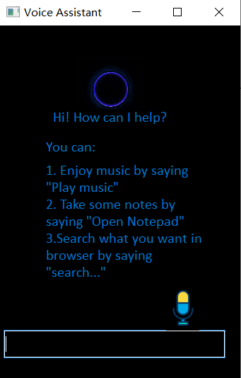
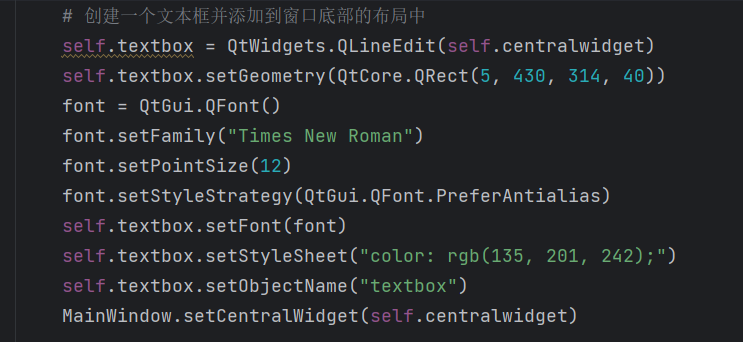
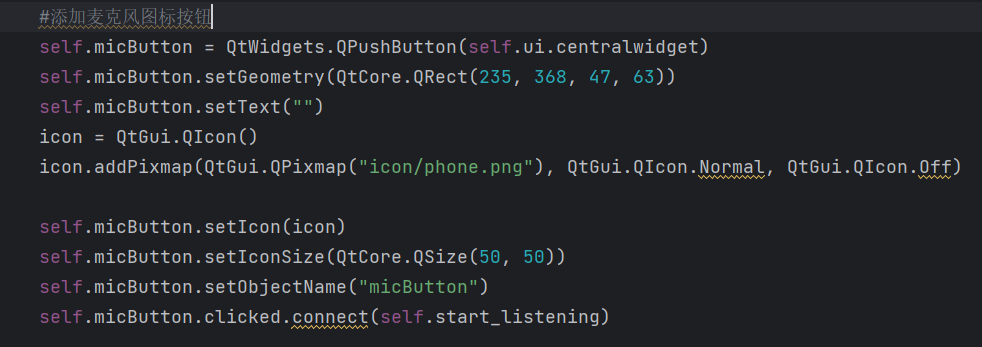
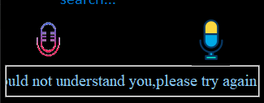
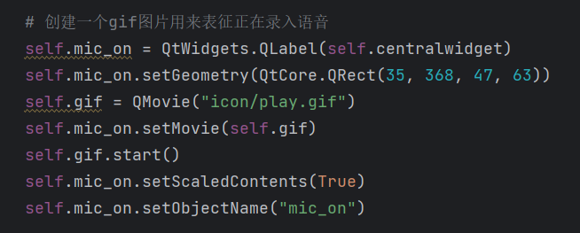
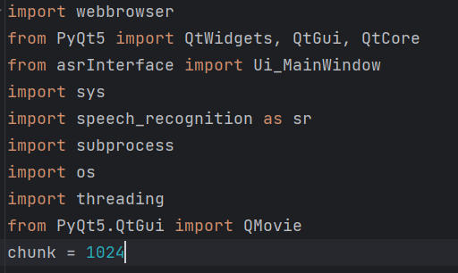
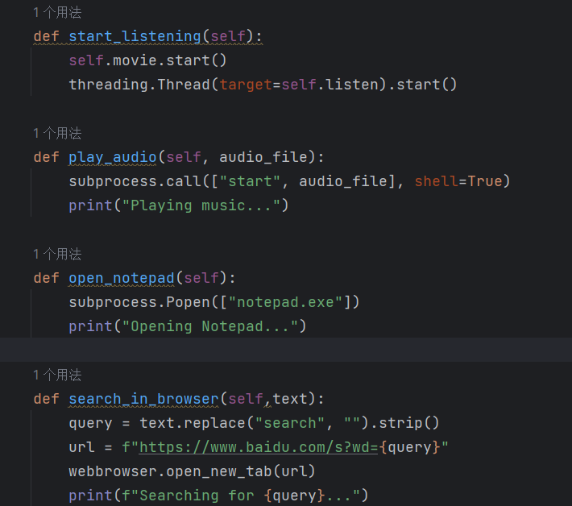
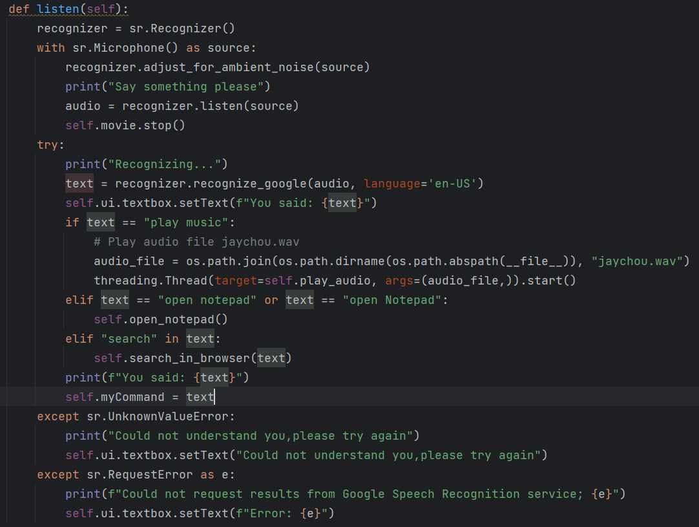
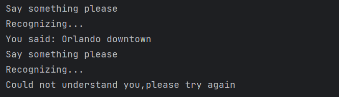
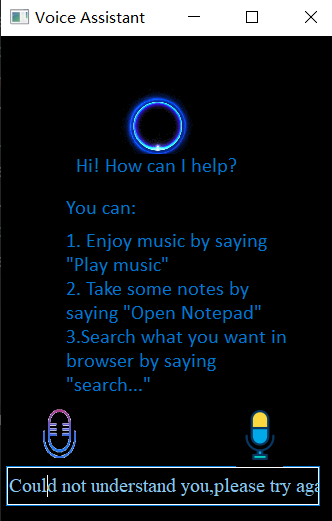

# Lab1 asr Report

## 1. The modifications to GUI and the codes

For the provided UI interface, while completing its basic speech recognition functions, I have also added my own design to enable users to better interact with it, making the system more complete and reliable.

Firstly, I adjusted the size and layout of the entire page, as well as the size of each block, so that the voice icon above and the prompt text below can be displayed in full at normal size.

From the above image, it can be seen that I have added a microphone icon and text box at the bottom of the page, and set their style and font. The microphone button is mainly used to click to input speech, and the text box below can display the content recognized by speech or related error messages. In order for them to display properly, I have added these two parts to the code.

 

Diagram 1 asrInterface.py-textbox

 

Diagram 2 asr.py-micButton

 In order to give users a sense of the process of voice interaction, I have added a gif animation in the bottom left corner of the page to indicate that voice input is in progress. When the user clicks the recording button on the right, the gif animation on the left will play, indicating that the user is entering voice. After the input is completed and recognition begins, the animation will automatically stop playing.

  

Diagram 3 asrInterface.py-mic_on

 In terms of code, firstly, this code imports some necessary libraries, including PyQt5 for graphical interface and speech_recognition is used for speech recognition, subprocess is used to start processes, QMovie is used to play animations, and so on. Among them, chunk=1024 defines the block size of the audio stream, also known as buffer size. This value is in bytes and controls the size of audio data obtained from the microphone each time.

Diagram 4 asr.py-Introduce necessary libraries and modules

The following code represents several functional functions that implement user needs during voice interaction, helping to process input voice information and perform corresponding operations based on the information. The "start_listening" function mainly controls the start of listening to the microphone, starting a new thread, and calling the "listen" function for speech recognition and subsequent processing. The 'play_audio' function is used to play audio files, and the 'subprocess. call' function is used to call the system's default audio player for playback. The 'open_notepad' function is called through the 'subprocess. Popen' function to open the system's default text editor. 'search_in_browser 'is used to search for the words and phrases that users need to search in the browser, by extracting search keywords from' text 'and concatenating them into the URL of Baidu search engine.

  

Diagram 5 asr.py-main functions

 The listen() function is used to monitor user's voice input and recognize their intent, which implements the specific functionalities of the voice interaction interface. Firstly, it uses a Recognizer object from the speech_recognition library to listen to the system microphone input. Before the voice input, it uses the adjust_for_ambient_noise() method to adjust the volume of the system microphone to improve the quality of the voice input. Then, it uses the listen() method to retrieve the voice input and save it as an audio file. Next, it uses the recognize_google() method to convert the audio file to text, and specifies the language for speech recognition as English using the language parameter. Finally, it executes the corresponding operation based on the content in the text, or displays an error message. Meanwhile, to avoid the interface freezing, the code uses multiple threads to perform some time-consuming operations, such as speech recognition and audio playback. 

 

Diagram 6 asr.py-listen() function

 Example(You can see more demos in the MP4 file in the folder):

## 2. The accuracy of speech recognition and how to improve it, if possible?

Through using Python's speech recognition library for user speech recognition, I found that the accuracy of ordinary speech recognition libraries is relatively low. After switching to Google's API, the recognition accuracy has improved somewhat, but it is still affected by environmental factors and the user's pronunciation standard. When the user's pronunciation is unclear or the sentence is not coherent, the accuracy of speech recognition will greatly decrease. At the same time, if there is noise in the surroundings, it will also interfere with the judgment of speech input and recognition. To reduce the impact of noise, you can try to use speech recognition in a quiet environment as much as possible, or use external devices such as noise-reducing microphones to reduce noise. To change the impact of pronunciation on speech recognition accuracy, techniques such as model adaptation can be used to improve accuracy, or machine learning can be used to train artificial intelligence with larger and more diverse and reliable language corpora, which may lead to better speech recognition results.