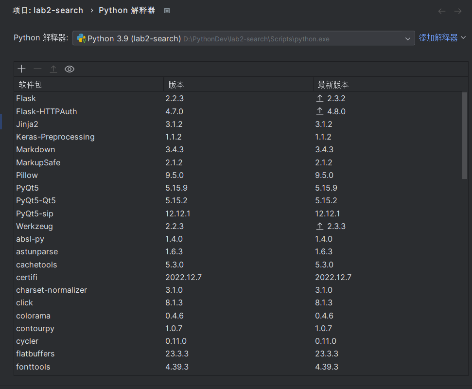
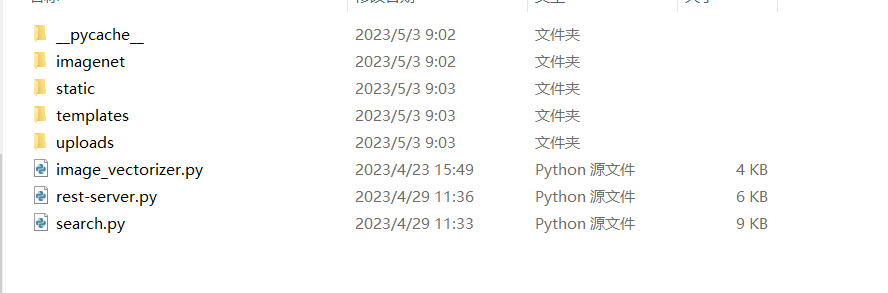
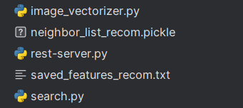
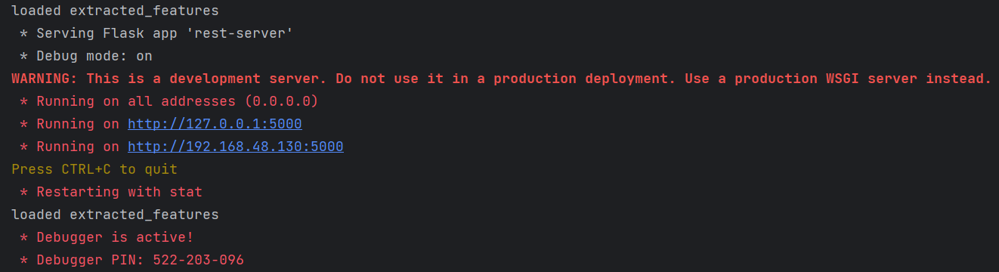
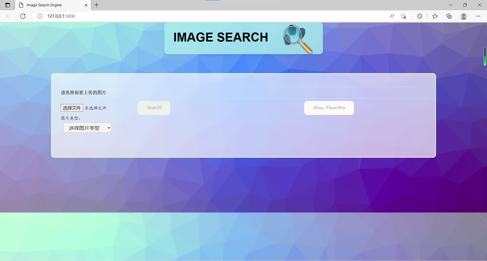

# How to run my program

1. If you haven't installed Python yet, please download and install Python from the official website first.

2. Open the download page of JetBrains official website in your browser: https://www.jetbrains.com/pycharm/download/#section=windows, download and install PyCharm.

3. Open PyCharm, create a new project, choose the interpreter and project location.

4. Install these packages in Pycharm: `Flask`、`PyQt5`、`numpy`、`TensorFlow`、`Flask-HTTPAuth`、`scipy`、`imageio`、`matplotlib`、`sklearn`...

   

5. Firstly, extract the folder in the compressed package and place the pre prepared "database" folder containing the image database under the "server" folder, which will be added to the newly created Pychar project.

   

6. Run `image_ Vectorizer. py` will automatically generate an image_ List. pickle and saved_ Two files, features.txt, are placed in the server folder.

   

7. Run `rest server. py` and click on the URL link to open the corresponding UI interface for image search operations.

   

