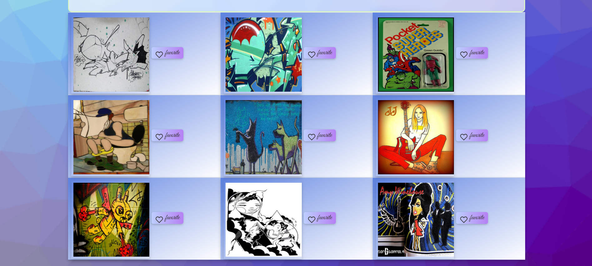
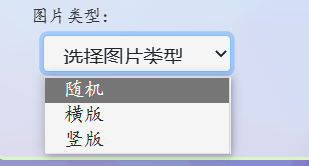
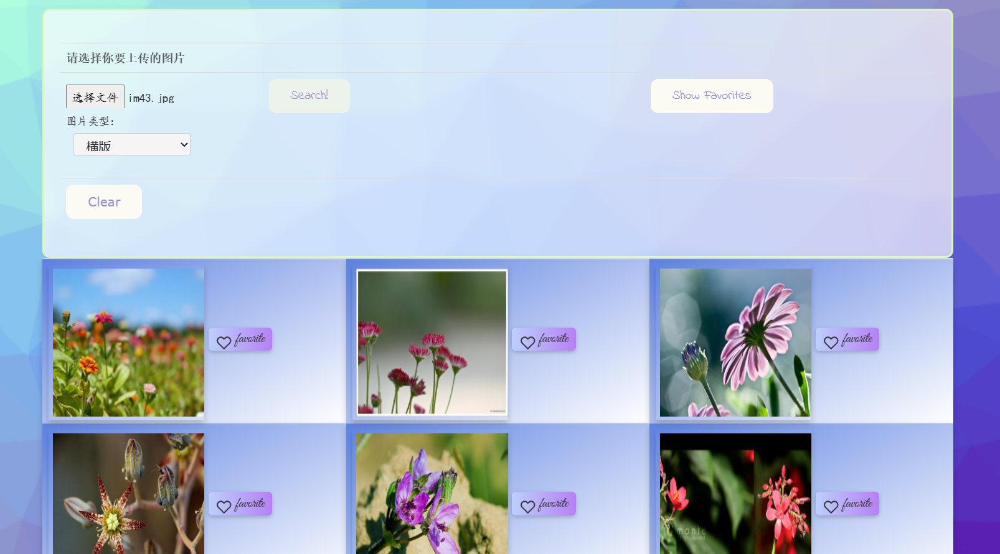

# Report of Lab2

[TOC]

## The requirements of an image search task

​    一个用于图片搜索的任务需要具备以下要求：

* 图片搜索功能：这是一个图片搜索任务的核心功能。用户需要能够上传或输入自己想要搜索的图片，然后搜索引擎会在数据库中搜索相似或匹配的图片，并将结果返回给用户。

* 数据库：一个良好的图片搜索网站需要有一个庞大的、高质量的图片数据库，以便搜索引擎能够在其中找到匹配的图片。

* 搜索算法：为了实现精确的图片搜索，一个搜索引擎需要有一种高效的、准确的搜索算法。这种算法应该能够将相似的图片匹配到一起，并根据相似度排序结果。

* 用户交互界面：一个优秀的图片搜索任务需要有一个直观、易用的用户界面，以便用户能够轻松地上传或输入自己的图片，并浏览和筛选搜索结果。用户界面应该包括搜索按钮、上传按钮、搜索结果页、筛选选项等。
* 自主选择上传内容：用户可以通过上传按钮选择本地文件中预览并找出需要搜索的图片，再进行上传操作，以供系统进行搜索。

* 搜索结果展示：搜索结果的展示也是一个重要的要求。搜索引擎应该能够给出一组匹配度较高的搜索结果，将相似的图片分组展示，并提供图片缩略图等信息，并且可以让用户查看该图片原图的具体样式。

* 添加收藏操作：图片搜索任务也需要为用户提供能够将想要获取的图片加入收藏列表的功能，以便用户可以继续在收藏列表中查看自己喜爱或者需要使用的图片，选择它们以进行后续操作。
* 用户自定义筛选：用户可以在某些方面对搜索出的图片结果进行自定义的筛选，比如图片尺寸、图片比例、图片颜色等等。
* 兼容性：一个好的图片搜索网站应该在不同的设备和浏览器上都能够正常运行，并提供响应式设计，以便在不同的屏幕尺寸上都能够呈现良好的用户体验。
* 安全性：图片搜索网站需要保护用户的隐私和安全。这包括对用户上传的图片进行安全性检查、保护用户的个人信息和搜索记录等。

## My designs for five stages

我对于 Five-stage search framework的设计理念主要在于用简洁美观的UI以及功能设计使得用户能够轻松地通过这个系统获取自己想要找到的图片信息。FIve-stages的具体设计如下：

1. Formulation：该图片搜索系统提供了一个可以上传文件的按钮，以此供用户浏览本地文件图片库中的图片选择需要搜索的源图片。
2. Initiation of action：页面中有一个search按钮来使用户开始搜索图片的过程。
3. Review：将一次性搜索到的九张图片展示在搜索框下方，以3×3的矩阵形式排列。
4. Refinement：在用户进行搜索时，添加了选择搜索结果类型的选项，代表搜索到的图片的类型，可供选择的类型有横版（图片宽度大于高度）、竖版（图片高度大于宽度），以此来提供更符合用户要求的搜索结果。
5. Use：用户搜索完成并且搜索结果已经展现在界面后，用户可以点击结果图片右侧的按钮选择将图片加入到收藏列表中。当用户点击搜索栏的“show favorites”按钮后，收藏列表中的图片会以轮播图形式依次显示。

## Features that I implement

首先是整体的界面样式，采用较为简约的风格以及明确的操作提示，能够使用户更好地使用这一图片搜索系统。


基础功能部分，设置了一个HTML表单，使用POST方法提交数据，并使用multipart/form-data编码类型，用于上传用户需要搜索的图片文件。同时search按钮可以提交上传的图片文件并开始搜索操作。


代码实现如下：

```html
<form method="post" enctype="multipart/form-data">       
<input type="file" name="file" style="font-family: 'YaSongTi', cursive;" required />
<input type="submit" value="Search!" onclick="fun()">
```

在后端方面，在 `search.py`文件中实现搜索算法，将搜索结果存储到一个图像列表中，等待前端发出POST请求。前端方面，使用jQuery的ajax()方法发送POST请求，其中url属性为"imgUpload"，请求方式为POST，数据为formData。contentType，cache和processData属性均为false，以便正确处理上传的图像数据。

```js
$.ajax({
      		 url: 'imgUpload',
       		 type: 'POST',
      		 data: formData,
      		 cache: false,
      		 contentType: false,
      		 enctype: 'multipart/form-data',
      		 processData: false,
             ...
   		});
```

在获取到上传图片相关的搜索结果后，将其依次显示在九块图片区域，搜索结果使用一个基本的HTML表格结构实现，其中每一行包含三个单元格，每个单元格都包含一个图片和一个可单击的收藏按钮，并用CSS进行样式美化。



具体的UI界面代码实现如下（以一行排列的3个搜索结果为例）：

```html
 <tr>
   <td class="tdstyle">
      
        <span class="addfavorite" onclick="addToFavorites('img0')">
          
            <span style="font-family: 'Great Vibes', cursive; font-size: 1.2em;
          vertical-align: top;">favorite</span>
        </span>
   </td>             
   <td class="tdstyle">
      
        <span class="addfavorite" onclick="addToFavorites('img1')">
          
          <span style="font-family: 'Great Vibes', cursive; font-size: 1.2em;
          vertical-align: top;">favorite</span>
        </span>
   </td>
   <td class="tdstyle">
     
        <span class="addfavorite" onclick="addToFavorites('img2')">
          
          <span style="font-family: 'Great Vibes', cursive; font-size: 1.2em;
          vertical-align: top;">favorite</span>
          </span>
   </td>
</tr>
```

为了给用户更精确搜索自己需要图片的体验，增加了一个功能：设置一个选择搜索图片类型的下拉菜单，用户可以自行选择三种图片样式：随机、横版（图片宽度大于高度）、竖版（图片宽度小于高度）。添加此功能后，用户搜索得到的图片将为特定的样式，方便用户进一步缩小搜素范围。




具体实现如下：后端方面，在 `search.py`中修改添加新的搜索算法，并在原来 `rest-sever.py`中 用于处理图像上传和处理Flask Web应用程序端点中加入判断条件，根据`orientation`的值，调用三个不同的推荐函数之一(`recommend()`、`recommend1()`或`recommend2()`)，并将`inputloc`和`extracted_features`作为参数传递。

```python
def upload_img():
    print("image upload")
    result = 'static/result'
    if not gfile.Exists(result):
          os.mkdir(result)
    shutil.rmtree(result)
    orientation = request.form.get('orientation')

    if request.method == 'POST' or request.method == 'GET':
        print(request.method)
        # check if the post request has the file part
        if 'file' not in request.files:
            print('No file part')
            return redirect(request.url)

        file = request.files['file']
        print(file.filename)
        # if user does not select file, browser also
        # submit a empty part without filename
        if file.filename == '':

            print('No selected file')
            return redirect(request.url)
        if file:# and allowed_file(file.filename):
            filename = secure_filename(file.filename)
            file.save(os.path.join(app.config['UPLOAD_FOLDER'], filename))
            inputloc = os.path.join(app.config['UPLOAD_FOLDER'], filename)
            if orientation=="none":
                recommend(inputloc, extracted_features)
            elif orientation=="horizontal":
                recommend1(inputloc, extracted_features)
            elif orientation=="vertical":
                recommend2(inputloc, extracted_features)
            os.remove(inputloc)
            image_path = "/result"
            image_list =[os.path.join(image_path, file) for file in os.listdir(result)
                              if not file.startswith('.')]
            images = {
			'image0':image_list[0],
            'image1':image_list[1],	
			'image2':image_list[2],	
			'image3':image_list[3],	
			'image4':image_list[4],	
			'image5':image_list[5],	
			'image6':image_list[6],	
			'image7':image_list[7],	
			'image8':image_list[8]
		      }				
            return jsonify(images)
```

UI界面方面，创建了一个下拉列表，用于选择随机、横版或竖版图像类型。在提交表单时，选择的选项名称将设置为“orientation”。样式类“custom-select”用于美化下拉列表，并使用中文楷体字体“YaSongTi”来设置选项文本的字体样式。第一个选项设置为默认禁用和隐藏的选项，用于指示用户选择图像类型。

```html
<select id="orientationSelect" name="orientation" class="custom-select">
     <option value="" disabled selected hidden style="font-family: 'YaSongTi', cursive;">选择图片类型</option>
     <option value="none" style="font-family: 'YaSongTi', cursive;">随机</option>
     <option value="horizontal" style="font-family: 'YaSongTi', cursive;">横版</option>
     <option value="vertical" style="font-family: 'YaSongTi', cursive;">竖版</option>
</select>
```

在加载搜索结果的过程中，提供一个水球的动画效果来显示加载百分比。通过一个带有三个波形SVG路径的加载动画实现，使用CSS隐藏，点击搜索后显示。加载过程中，SVG路径的填充颜色将动态改变，显示加载进度的百分比。


```html
<div id="load" class="box flex-row j_c" style="display:none">
      <div class="box-inner">
         <div class="inner" style="--per:0%" id="box">
           <svg xmlns="http://www.w3.org/2000/svg" version="1.0" viewBox="0 0 600 140" class="box-waves">
             <path d="M 0 70 Q 75 20,150 70 T 300 70 T 450 70 T 600 70 L 600 140 L 0 140 L 0 70Z">
             </path>
           </svg>
           <svg xmlns="http://www.w3.org/2000/svg" version="1.0" viewBox="0 0 600 140" class="box-waves">
             <path d="M 0 70 Q 75 20,150 70 T 300 70 T 450 70 T 600 70 L 600 140 L 0 140 L 0 70Z">
             </path>
           </svg>
           <svg xmlns="http://www.w3.org/2000/svg" version="1.0" viewBox="0 0 600 140" class="box-waves">
             <path d="M 0 70 Q 75 20,150 70 T 300 70 T 450 70 T 600 70 L 600 140 L 0 140 L 0 70Z">
             </path>
           </svg>
         </div>
       </div>
       <div id="percentText" class="box-text">--%</div>
     </div>
```

为了使用户能够在找到想要的搜索结果后能够记录下来以便进行后续的操作，我在这个系统中加入了一个收藏的功能，为每一个搜索到的图片结果添加一个按钮，使用户能够添加他们喜爱的图片。然后在搜索栏添加了一个 `show favorites`的按钮，使用户能够点击查看自己已经收藏的图片以进行后续操作。



具体实现方面，对每一张图片设置一个“添加到收藏夹”按钮，包括一个用于触发添加操作的点击事件和一个包含图标和文本的HTML元素。 图标是一个SVG图像，使用JavaScript函数将其更改为收藏夹添加成功时的不同图像。文本部分使用手写字体“Great Vibes”并设置字体大小为1.2em，表示该按钮的操作为“favorite”。

```html
<span class="addfavorite" onclick="addToFavorites('img0')">
     
     <span style="font-family: 'Great Vibes', cursive; font-size: 1.2em;vertical-align:top;">favorite</span>
</span>
```

```js
var favorites = [];
var currentIndex = 0;

function addToFavorites(imgId) {
  var img = document.getElementById(imgId);
  var imgUrl = img.src;
  if (!favorites.includes(imgUrl)) {
    document.getElementById("fav"+imgId.charAt(3)).src="{{ url_for('static', filename='images/favor_after.svg') }}";
    favorites.push(imgUrl);
    console.log(favorites);
  }
};
```

点击 `show favorites`按钮后，通过JavaScript绑定点击成功后的函数使收藏列表中的图片展现出来。


```js
function showFavorites() {
  var favList = document.getElementById("favList");
  $('#favList').show();
  favList.innerHTML = "";
  $('#pictures').hide();
  for (var i = 0; i < favorites.length; i++) {
    var img = document.createElement("img");
    img.src = favorites[i];
    img.addEventListener('click', function() {
      // 切换到下一张图片
      currentIndex = (currentIndex + 1) % favorites.length;
      updateActiveClass();
    });
    favList.appendChild(img);
  }
  updateActiveClass();
}
```

同时，本图片搜索系统还有一些其他设计，比如当鼠标移至标题栏时，标题栏会变色，鼠标移至标题栏右侧的放大镜图片，该图片会产生旋转三百六十度的效果，点击它会对页面实现刷新操作。


