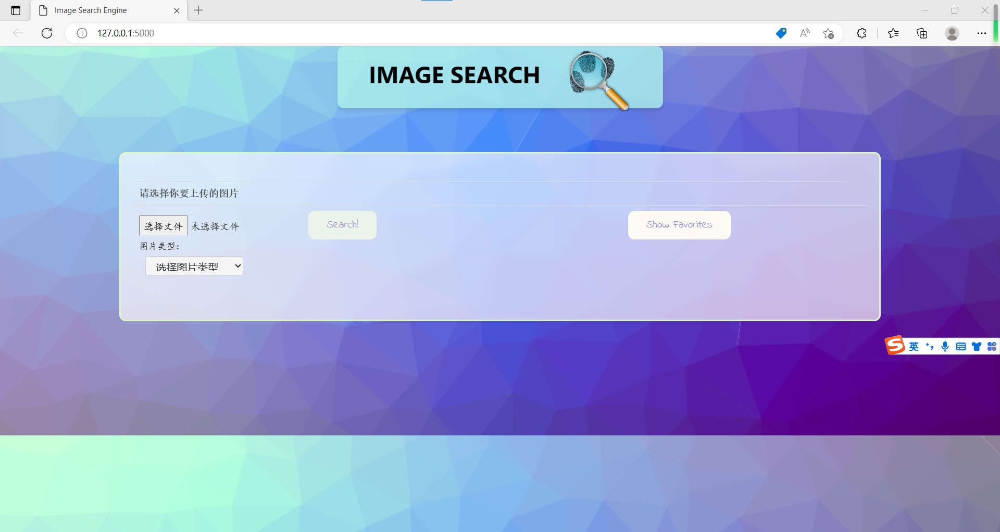
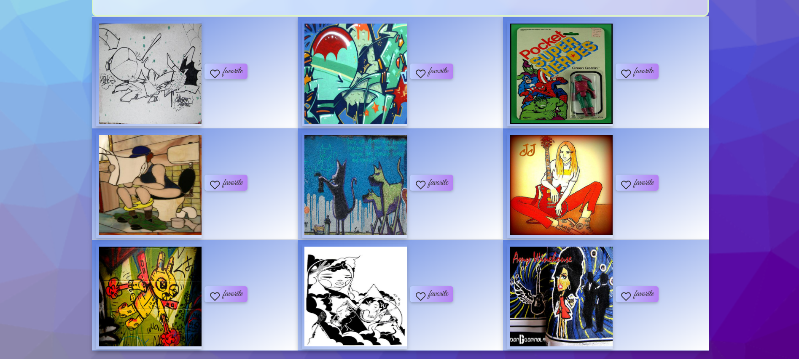
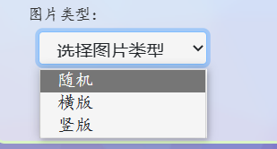
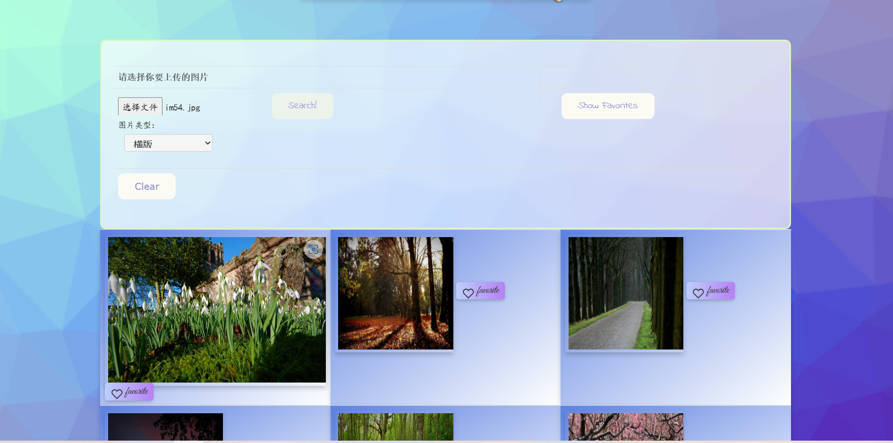
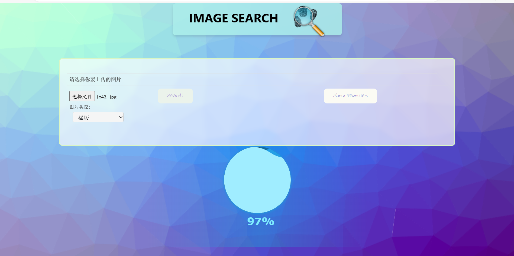
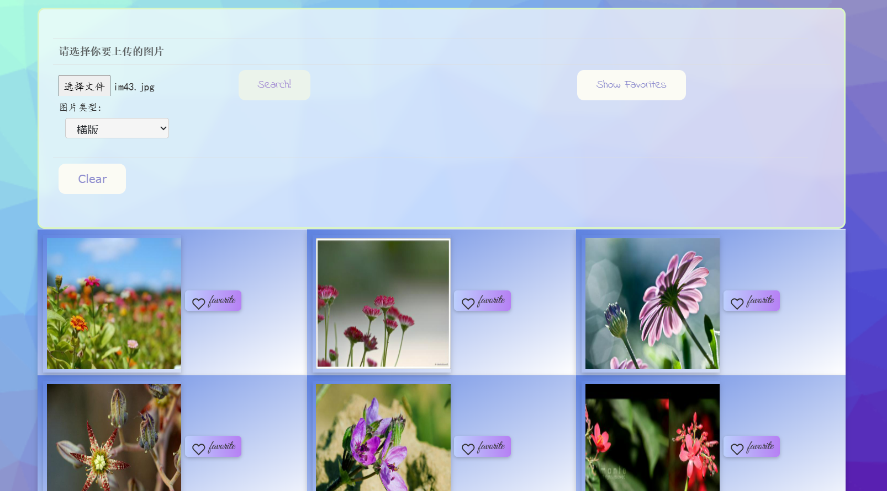
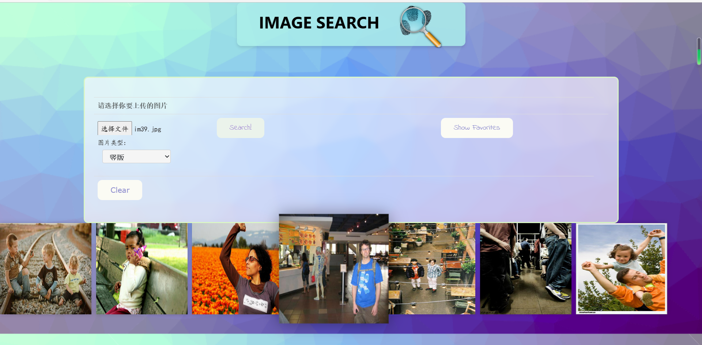

# Report of Lab2

[TOC]

## The requirements of an image search task

 A task for image search requires the following requirements：

* Image search function: This is the core function of an image search task. Users need to be able to upload or input the images they want to search for, and then search engines will search for similar or matching images in the database and return the results to the user.

* Database: A good image search task requires a large, high-quality image database in which search engines can find matching images.

* Search algorithm: In order to achieve accurate image search, a search engine needs to have an efficient and accurate search algorithm. This algorithm should be able to match similar images together and sort the results based on similarity.

* User interaction interface: An excellent image search task requires an intuitive and easy-to-use user interface, so that users can easily upload or input their own images, and browse and filter search results. The user interface should include search buttons, upload buttons, search engine results page, filtering options, etc.
* Independently choose the upload content: Users can preview and find the image to search in the local file through the upload button, and then upload it for the system to search.

* Display of search results: Display of search results is also an important requirement. Search engines should be able to provide a set of highly matched search results, group and display similar images, provide information such as image thumbnails, and allow users to view the specific style of the original image.

* Add Favorite Operation: The image search task also needs to provide users with the ability to add the desired images to the favorites list, so that users can continue to view their favorite or desired images in the favorites list and select them for subsequent operations.
* User defined filtering: Users can customize the filtering of image results in certain aspects, such as image size, image proportion, image color, and so on.
* Compatibility: A good image search website should run normally on different devices and browsers, and provide responsive design to present a good user experience on different screen sizes.
* Security: Image search websites need to protect users' privacy and security. This includes conducting security checks on images uploaded by users, protecting their personal information and search records, etc.

## My designs for five stages

My design philosophy for the Five stage search framework is mainly to use a simple and beautiful UI and functional design to make it easy for users to obtain the image information they want through this system. The specific design of FIve stages is as follows:

1. Formulation：The image search system provides a button that allows users to upload files, allowing them to browse through images in the local file image library and select the source image to search for.
2. Initiation of action：There is a search button on the page to start the process of searching for images.
3. Review：Display the nine images found in a single search below the search box, arranged in 3 rows and 3 columns.
4. Refinement：When users search, an option has been added to select the type of search result, representing the type of images found. The available types are horizontal (image width greater than height) and vertical (image height greater than width), in order to provide search results that better meet user requirements.
5. Use：After the user completes the search and the search results have been displayed on the interface, they can click the button on the right side of the result image to choose to add the image to the favorites list. When the user clicks on the "show favorites" button in the search bar, the images in the favorites list will be displayed in a rotating chart format.

## Features that I implement

Firstly, the overall interface style is adopted, with a relatively simple style and clear operating instructions, which can enable users to better use this image search system.



In the basic functional section, an HTML form was set up to submit data using the POST method, and the multipart/form data encoding type was used to upload image files that users need to search for. At the same time, the search button can submit the uploaded image file and start the search operation.


The code implementation is as follows:

```html
<form method="post" enctype="multipart/form-data">       
<input type="file" name="file" style="font-family: 'YaSongTi', cursive;" required />
<input type="submit" value="Search!" onclick="fun()">
```

On the backend side, implement a search algorithm in the `search. py` file, store the search results in an image list, and wait for the front-end to issue a POST request. On the front-end side, use jQuery's ajax() method to send a POST request, where the URL attribute is "imgUpload", the request method is POST, and the data is formData. The contentType, cache, and processData attributes are all false for proper processing of uploaded image data.

```js
$.ajax({
      		 url: 'imgUpload',
       		 type: 'POST',
      		 data: formData,
      		 cache: false,
      		 contentType: false,
      		 enctype: 'multipart/form-data',
      		 processData: false,
             ...
   		});
```

After obtaining search results related to uploaded images, they are sequentially displayed in nine image areas. The search results are implemented using a basic HTML table structure, where each row contains three cells, each containing an image and a clickable favorite button, and are styled using CSS.



The specific UI interface code implementation is as follows (taking three search results arranged in a row as an example):

```html
 <tr>
   <td class="tdstyle">
      
        <span class="addfavorite" onclick="addToFavorites('img0')">
          
            <span style="font-family: 'Great Vibes', cursive; font-size: 1.2em;
          vertical-align: top;">favorite</span>
        </span>
   </td>             
   <td class="tdstyle">
      
        <span class="addfavorite" onclick="addToFavorites('img1')">
          
          <span style="font-family: 'Great Vibes', cursive; font-size: 1.2em;
          vertical-align: top;">favorite</span>
        </span>
   </td>
   <td class="tdstyle">
     
        <span class="addfavorite" onclick="addToFavorites('img2')">
          
          <span style="font-family: 'Great Vibes', cursive; font-size: 1.2em;
          vertical-align: top;">favorite</span>
          </span>
   </td>
</tr>
```

In order to provide users with a more accurate experience of searching for the images they need, a feature has been added: a drop-down menu has been set to select the type of search image. Users can choose three image styles: random, horizontal (image width greater than height), and vertical (image width smaller than height). After adding this feature, the images that users search for will have a specific style, making it easier for users to further narrow their search scope.





The specific implementation is as follows: On the backend side, a new search algorithm is modified and added to `search. py`, and judgment criteria are added to the original `rest sever. py` for processing image uploads and processing Flask web application endpoints. Based on the value of `orientation`, one of the three different recommendation functions (`recommend()`, `recommend1()`, or `recommend2()`) is called, and 'inputloc' and 'extracted' are added_ Features' are passed as parameters.

```python
def upload_img():
    print("image upload")
    result = 'static/result'
    if not gfile.Exists(result):
          os.mkdir(result)
    shutil.rmtree(result)
    orientation = request.form.get('orientation')

    if request.method == 'POST' or request.method == 'GET':
        print(request.method)
        # check if the post request has the file part
        if 'file' not in request.files:
            print('No file part')
            return redirect(request.url)

        file = request.files['file']
        print(file.filename)
        # if user does not select file, browser also
        # submit a empty part without filename
        if file.filename == '':

            print('No selected file')
            return redirect(request.url)
        if file:# and allowed_file(file.filename):
            filename = secure_filename(file.filename)
            file.save(os.path.join(app.config['UPLOAD_FOLDER'], filename))
            inputloc = os.path.join(app.config['UPLOAD_FOLDER'], filename)
            if orientation=="none":
                recommend(inputloc, extracted_features)
            elif orientation=="horizontal":
                recommend1(inputloc, extracted_features)
            elif orientation=="vertical":
                recommend2(inputloc, extracted_features)
            os.remove(inputloc)
            image_path = "/result"
            image_list =[os.path.join(image_path, file) for file in os.listdir(result)
                              if not file.startswith('.')]
            images = {
			'image0':image_list[0],
            'image1':image_list[1],	
			'image2':image_list[2],	
			'image3':image_list[3],	
			'image4':image_list[4],	
			'image5':image_list[5],	
			'image6':image_list[6],	
			'image7':image_list[7],	
			'image8':image_list[8]
		      }				
            return jsonify(images)
```

In terms of UI interface, a drop-down list has been created to select random, horizontal, or vertical image types. When submitting the form, the selected option name will be set to "orientation". The style class' custom select 'is used to beautify the drop-down list and use the Chinese regular font' YaSongTi 'to set the font style for option text. The first option is set to the default disabled and hidden options, used to instruct the user to choose an image type.

```html
<select id="orientationSelect" name="orientation" class="custom-select">
     <option value="" disabled selected hidden style="font-family: 'YaSongTi', cursive;">选择图片类型</option>
     <option value="none" style="font-family: 'YaSongTi', cursive;">随机</option>
     <option value="horizontal" style="font-family: 'YaSongTi', cursive;">横版</option>
     <option value="vertical" style="font-family: 'YaSongTi', cursive;">竖版</option>
</select>
```

During the process of loading search results, provide an animated effect of a water ball to display the loading percentage. Implemented through a loading animation with three waveform SVG paths, hidden using CSS, and displayed after clicking on search. During the loading process, the filling color of the SVG path will dynamically change, displaying the percentage of loading progress.



```html
<div id="load" class="box flex-row j_c" style="display:none">
      <div class="box-inner">
         <div class="inner" style="--per:0%" id="box">
           <svg xmlns="http://www.w3.org/2000/svg" version="1.0" viewBox="0 0 600 140" class="box-waves">
             <path d="M 0 70 Q 75 20,150 70 T 300 70 T 450 70 T 600 70 L 600 140 L 0 140 L 0 70Z">
             </path>
           </svg>
           <svg xmlns="http://www.w3.org/2000/svg" version="1.0" viewBox="0 0 600 140" class="box-waves">
             <path d="M 0 70 Q 75 20,150 70 T 300 70 T 450 70 T 600 70 L 600 140 L 0 140 L 0 70Z">
             </path>
           </svg>
           <svg xmlns="http://www.w3.org/2000/svg" version="1.0" viewBox="0 0 600 140" class="box-waves">
             <path d="M 0 70 Q 75 20,150 70 T 300 70 T 450 70 T 600 70 L 600 140 L 0 140 L 0 70Z">
             </path>
           </svg>
         </div>
       </div>
       <div id="percentText" class="box-text">--%</div>
     </div>
```

In order to enable users to record their desired search results for subsequent operations, I have added a favorite feature to this system, which adds a button for each image result found, allowing users to add their favorite images. Then a `show favorites` button was added to the search bar, allowing users to click to view their favorite images for subsequent operations.



In terms of specific implementation, a "Add to Favorites" button is set for each image, including a click event to trigger the add operation and an HTML element containing icons and text. The icon is an SVG image that can be changed to a different image when successfully added as a favorite using JavaScript functions. The text section uses the handwritten font "Great Vibes" and sets the font size to 1.2em, indicating that the button's operation is "favorite".

```html
<span class="addfavorite" onclick="addToFavorites('img0')">
     
     <span style="font-family: 'Great Vibes', cursive; font-size: 1.2em;vertical-align:top;">favorite</span>
</span>
```

```js
var favorites = [];
var currentIndex = 0;

function addToFavorites(imgId) {
  var img = document.getElementById(imgId);
  var imgUrl = img.src;
  if (!favorites.includes(imgUrl)) {
    document.getElementById("fav"+imgId.charAt(3)).src="{{ url_for('static', filename='images/favor_after.svg') }}";
    favorites.push(imgUrl);
    console.log(favorites);
  }
};
```

After clicking the `show favorites` button, bind the successfully clicked function with JavaScript to display the images in the favorites list.



```js
function showFavorites() {
  var favList = document.getElementById("favList");
  $('#favList').show();
  favList.innerHTML = "";
  $('#pictures').hide();
  for (var i = 0; i < favorites.length; i++) {
    var img = document.createElement("img");
    img.src = favorites[i];
    img.addEventListener('click', function() {
      // 切换到下一张图片
      currentIndex = (currentIndex + 1) % favorites.length;
      updateActiveClass();
    });
    favList.appendChild(img);
  }
  updateActiveClass();
}
```

At the same time, there are some other designs in this image search system. For example, when the mouse is moved to the title bar, the title bar will change color. When the mouse is moved to the magnifying glass image on the right side of the title bar, the image will rotate 360 degrees, and clicking it will refresh the page.

