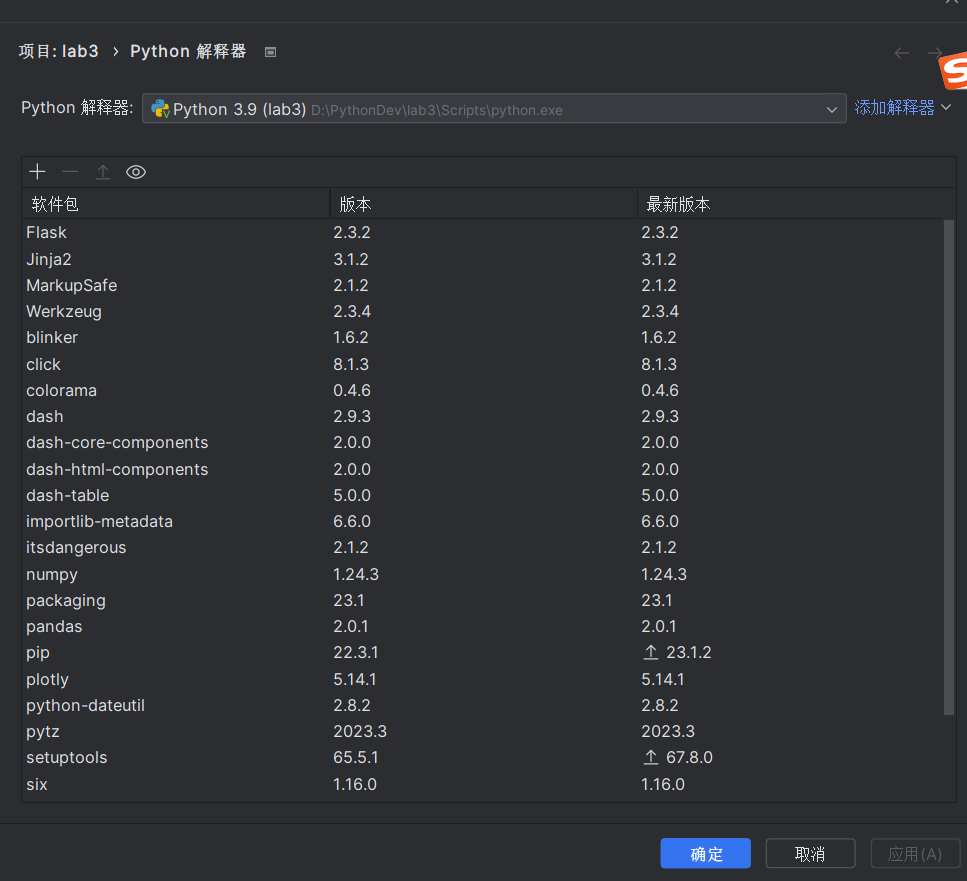
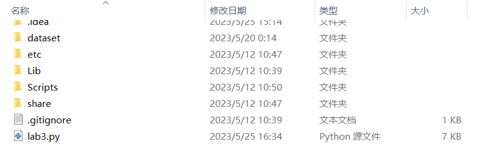
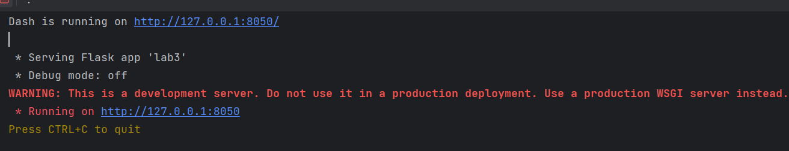
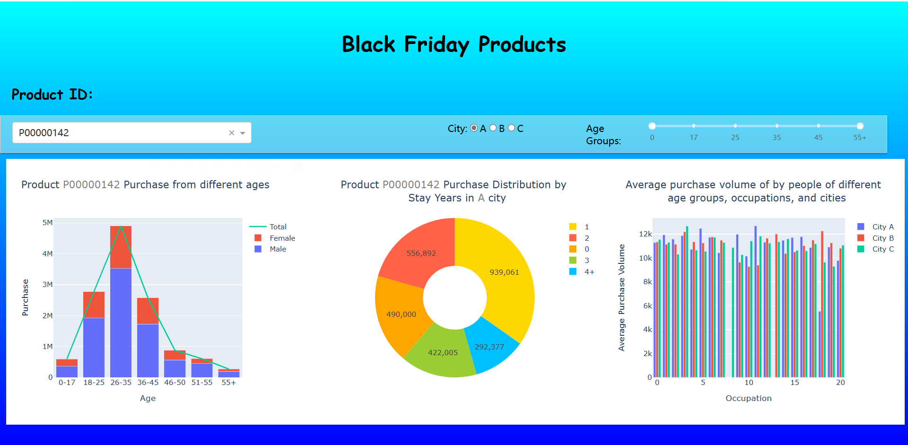

# How to run this program

1. If you haven't installed Python yet, please download and install Python from the official website first.

2. Open the download page of JetBrains official website in your browser: https://www.jetbrains.com/pycharm/download/#section=windows, download and install PyCharm.

3. Open PyCharm, create a new project, choose the interpreter and project location.

4. Install these packages in Pycharm:  `pandas`、 `dash`、 `plotly`、`Flask`...

   

5. Add both the `dataset` folder and the `lab3. py` file to the project folder

   

6. Run `lab3. py` and click on the URL link to open the corresponding UI interface for Dash data visualization page.

   

