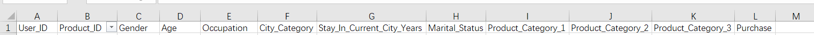
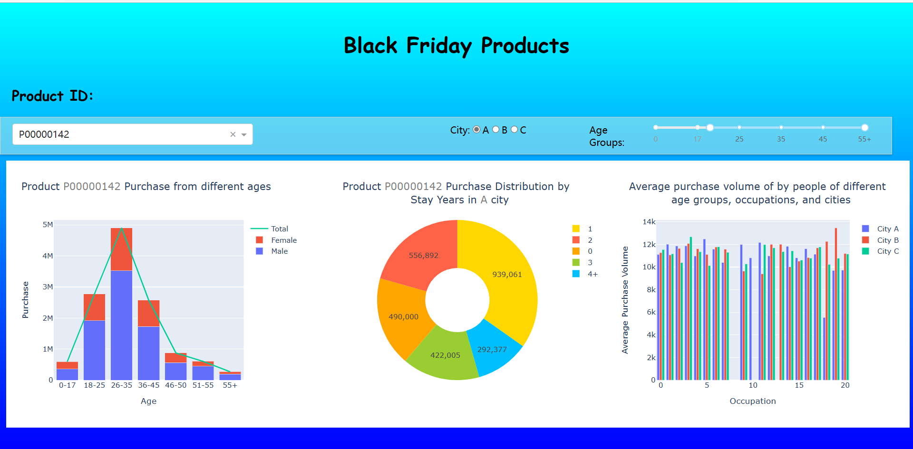
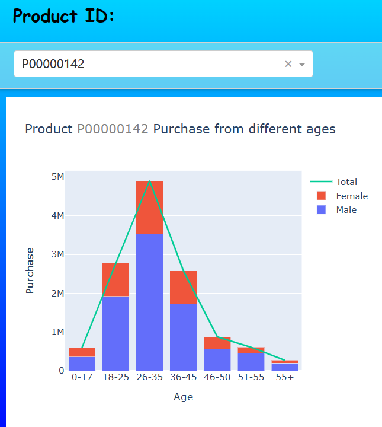
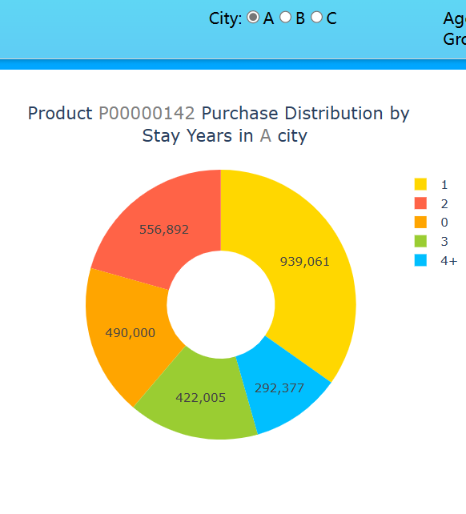
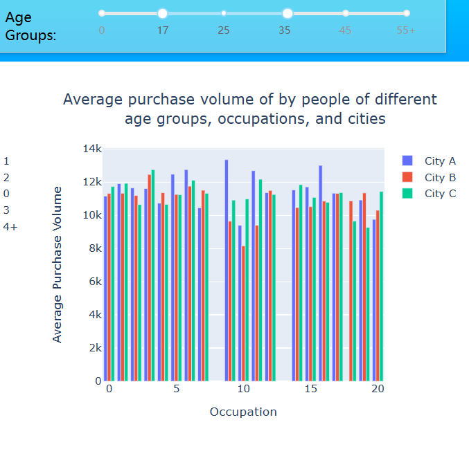

# Report

[TOC]

## 1  Describe a data analysis task for the chosen dataset (objectives, characteristics of the dataset, etc)

我选择的数据集是"BlackFriday",它包含了一个特定的时期零售店交易量与不同人群的特征，主要包括性别、年龄、职业、居住城市、居住时间等信息，具体样本包含的数据名称如下。

这个数据集的样本容量较大，可以比较好的反映出该时间段的交易情况。同时该数据集比较符合实际情况，各部分数据分布比较合理，选取的样本比较合适，不会出现特别极端的结果。

对这个数据集进行数据分析的目的主要是以下几种：

* 通过对于不同特征人群购买量的分析，为不同类型的顾客形成特定的用户画像，从而为商家决策售卖商品的种类和数量提供帮助。
* 通过对不同数据的整合分析，得到店铺所在地用户的商品购买欲望以及购买倾向，从而帮助该地商家决策售卖的商品种类和数量
* 通过对过去零售店交易样本的分析，预测将来的一段时间内各种类商品的销售情况
* 通过对消费者年龄和购买量的分析，整合得出每种商品适合的顾客年龄段
* 通过对不同商品受众群体聚类，便于在其中找到不同的消费者集群
* 直观地得到消费者、城市、产品本身、购买量这些因素之间的大致关系

## 2  Describe the layout of designed dashboard and briefly describe the patterns revealed in the figures

### 2.1 整体布局及功能

整体页面布局及功能如下：

* 背景使用线性渐变背景，通过设置位置属性 (position) 和尺寸属性 (top, bottom, left, right) 将背景铺满整个屏幕。

* 页面标题为 "Black Friday Products"，标题居中显示。

* 使用Product_ID作为三个图表统一的选择器，即更改Product_ID三种图表也会随之变化。除此以外，还有分别用于选择城市和年龄范围的两个过滤器来分别对后两个图表进行过滤从而得到想要的可视化结果。

  具体效果为：

  - 使用下拉选择框 (Dropdown) 来选择产品 ID。
  - 使用单选按钮 (RadioItems) 来选择城市。
  - 使用范围滑块 (RangeSlider) 来选择年龄范围。

* 可视化图表部分，使用三个图表组件分别显示堆叠柱状图、饼图和柱状图，并将三个图表组件置在一个 Div 容器中，使用 flex 布局。三个可视化图表分别表示”不同年龄段和性别人群对当前产品的购买量分布”，“不同居住城市和居住时间人群对当前产品购买量的占比”，“不同年龄段、职业以及城市的人群对当前产品平均购买量的分布”。

整体可视化页面效果如下：

### 2.2 堆叠柱状图

* 内容：该图表显示了选择的产品ID在不同年龄和性别组合中的购买量分布。

* 操作方法以及图中信息：通过下拉菜单选择产品ID。图表会根据所选产品ID更新并展示对应的购买量数据。图表中的堆叠柱状图表示不同年龄组合下男性和女性的购买量，以及总购买量的趋势线。

* 可利用性：

  - 商家可以选择特定的产品ID，了解不同年龄和性别组合中的购买量分布。这可以帮助商家了解不同人群对其产品的兴趣和偏好。
  - 商家可以根据堆叠柱状图中的总购买量趋势线，观察不同年龄和性别组合的总体购买趋势。这有助于商家确定销售策略和市场定位，例如针对特定年龄段或性别的广告宣传和促销活动。

* 展示：

  例如对于以下图表，它表明26-35岁年龄段对该产品购买量最多，且男性明显多于女性，中老年人对此产品购买量较少。

  

### 2.3饼图

- 内容：该图表显示了选择的城市中选定产品的不同居住年限的购买分布。
- 操作方法以及图中信息：通过单选按钮选择城市，以及通过下拉菜单选择产品ID。图表会根据所选城市和产品ID更新并展示购买分布数据。饼图的扇区表示不同居住年限的购买量占总购买量的比例。
- 可利用性：
  - 商家可以选择特定的城市和产品ID，了解在特定城市中不同居住年限的购买分布。这可以帮助商家了解在不同居住年限下的客户购买行为差异，为市场定位和产品推广提供参考。
  - 商家可以通过饼图中的比例，发现在特定城市中的不同居住年限下的潜在市场机会。例如，如果某个城市中有较多新移居的人群，商家可以针对他们开展定向宣传活动。

* 展示：

  例如对于下图，它表示对于A城市的居民，在该城市居住仅一年的居民更倾向于购买该产品，在该城市居住四年以上的居民对于该产品的购买欲望最少。

  

### 2.3 柱状图

- 内容：该图表显示了选定年龄范围内不同职业和城市的平均购买量。
- 操作方法以及图中信息：通过滑动条选择年龄范围，以及通过下拉菜单选择产品ID。图表会根据所选年龄范围和产品ID更新并展示平均购买量数据。图表中的每个柱状图表示一个职业在不同城市中的平均购买量，通过不同颜色区分不同城市。
- 可利用性：
  - 商家可以选择特定的年龄范围和产品ID，了解在不同职业和城市中的平均购买量。这可以帮助商家确定在特定职业和城市中的潜在市场机会，以及客户购买行为的差异。
  - 商家可以通过柱状图中的条形的高度和颜色，发现在不同城市和职业中的购买量差异。这有助于商家确定市场细分和目标客户群体，以及在特定城市和职业中的市场推广策略。

* 展示：

  例如对于下图，它表示对于17-35这个年龄段的人群，不同职业以及居住城市的不同导致对于该产品平均购买量分布的不同。

  