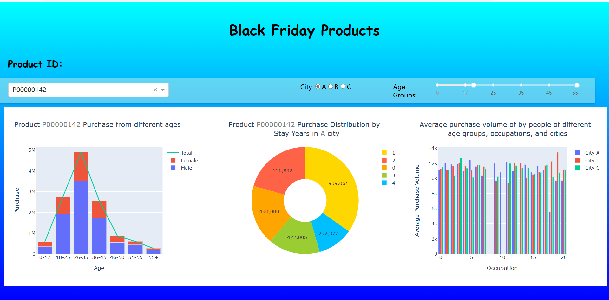
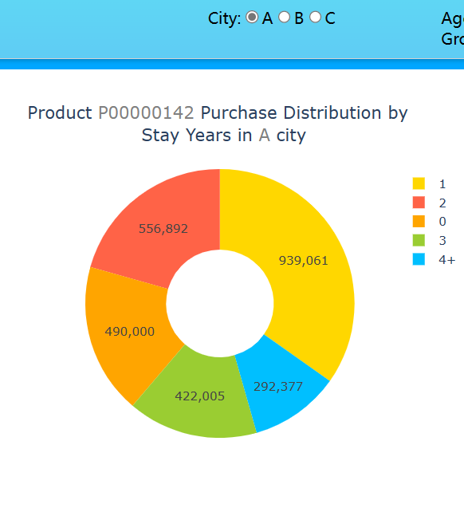

# Report

[TOC]

## 1  Describe a data analysis task for the chosen dataset (objectives, characteristics of the dataset, etc)

The dataset I selected is' BlackFriday ', which includes the transaction volume of retail stores during a specific period and the characteristics of different populations, mainly including information such as gender, age, occupation, city of residence, and time of residence. The specific data names included in the sample are as follows.

The sample size of this dataset is relatively large, which can better reflect the trading situation during that time period. At the same time, this dataset is quite in line with the actual situation, with a reasonable distribution of data in various parts, and the selected samples are relatively suitable, without particularly extreme results.
The main purposes of conducting data analysis on this dataset are as follows:

* By analyzing the purchase volume of different characteristic groups, specific user profiles are formed for different types of customers, thereby providing assistance for merchants in deciding on the types and quantities of products to sell.
* By integrating and analyzing different data, we can obtain the purchasing desires and tendencies of users in the location of the store, thereby helping businesses in that area make decisions on the types and quantities of products to sell
* By analyzing past retail store transaction samples, predict the sales situation of various types of goods in the future over a period of time
* By analyzing the age and purchase volume of consumers, we can integrate and determine the appropriate age range for each product
* By clustering different product audience groups, it is easy to find different consumer clusters within them
* Intuitively obtain the approximate relationship between factors such as consumers, cities, products themselves, and purchase volume

## 2  Describe the layout of designed dashboard and briefly describe the patterns revealed in the figures

### 2.1 Overall Layout and Functions

Overall layout and functions are as follows：

* The background uses a linear gradient background, which is spread throughout the entire screen by setting position and size attributes (top, bottom, left, right).

* The page title is' Black Friday Products', with the title centered.

* Using **Product_ID** serves as a unified selector for the three charts, that is, to change the **Product_ ID** , the three types of charts will also change accordingly. In addition, there are two filters for selecting cities and age ranges to filter the last two charts separately to obtain the desired visualization results.

  The detailed effects are:

  - Use the dropdown selection box(**Dropdown**) to select the product ID.
  - Use the radio buttons (**RadioItems**) to select a city.
  - Use the Range Slider (**RangeSlider**) to select the age range.

* Visualize the chart section, using three chart components to display stacked bar charts, pie charts, and bar charts, and placing the three chart components in a Div container using flex layout. Three visualization charts represent the distribution of current product purchases by different age groups and gender groups, the proportion of current product purchases by people living in different cities and time periods, and the distribution of average product purchases by people living in different age groups, occupations, and cities.

The overall visual page effect is as follows:

### 2.2 Stacked Column Chart

* Content: This chart shows the distribution of purchase volume for the selected product ID across different age and gender combinations.

* Operation method and information in the figure: Select the product ID through the drop-down menu. The chart will update and display the corresponding purchase volume data based on the selected product ID. The stacked bar chart in the chart represents the purchasing volume of men and women under different age groups, as well as the trend line of total purchasing volume.

* Availability:

  - Merchants can choose specific product IDs to understand the distribution of purchase volume across different age and gender combinations. This can help businesses understand the interests and preferences of different groups of people for their products.
  - Merchants can observe the overall purchase trend of different age and gender combinations based on the trend line of total purchase volume in the stacked bar chart. This helps businesses determine sales strategies and market positioning, such as advertising and promotional activities targeting specific age groups or genders.

* Display:

  For example, for the following chart, it shows that the age group of 26 to 35 has the highest purchase volume of this product, with significantly more males than females, and fewer middle-aged and elderly people purchasing this product.

  

### 2.3 Pie Chart

- Content: This chart displays the purchase distribution of the selected products in the selected cities for different years of residence.
- Operation method and information in the figure: select the city through the radio button, and select the product ID through the drop-down menu. The chart will update and display purchase distribution data based on the selected city and product ID. The sector of the pie chart represents the proportion of purchases for different years of residence to the total purchase volume.
- Availability:
  - Merchants can choose a specific city and product ID to understand the purchase distribution of different years of residence in a specific city. This can help businesses understand the differences in customer purchasing behavior under different years of residence, providing reference for market positioning and product promotion.
  - Merchants can discover potential market opportunities for different years of residence in a specific city through the proportion in the pie chart. For example, if there are many new immigrants in a certain city, businesses can carry out targeted promotional activities targeting them.

* Display:

  For example, for the following figure, it indicates that for residents of City A, residents who have lived in the city for only one year are more likely to purchase the product, while residents who have lived in the city for more than four years have the least desire to purchase the product.

  

### 2.3 Histogram

- Content: This chart displays the average purchase volume of different professions and cities within the selected age range.
- Operation method and information in the figure: select the age range through the slider, and select the product ID through the drop-down menu. The chart will update and display average purchase volume data based on the selected age range and product ID. Each bar chart in the chart represents the average purchase volume of a profession in different cities, distinguished by different colors.
- Availability:
  - Merchants can choose a specific age range and product ID to understand the average purchase volume in different professions and cities. This can help businesses identify potential market opportunities in specific professions and cities, as well as differences in customer purchasing behavior.
  - Merchants can discover differences in purchase volume among different cities and professions by examining the height and color of the bars in the bar chart. This helps businesses determine market segmentation and target customer groups, as well as marketing strategies in specific cities and occupations.

* Display:

  For example, for the following figure, it indicates that for the 17-35 age group, different professions and cities of residence result in different distribution of average purchase volume for this product.

  